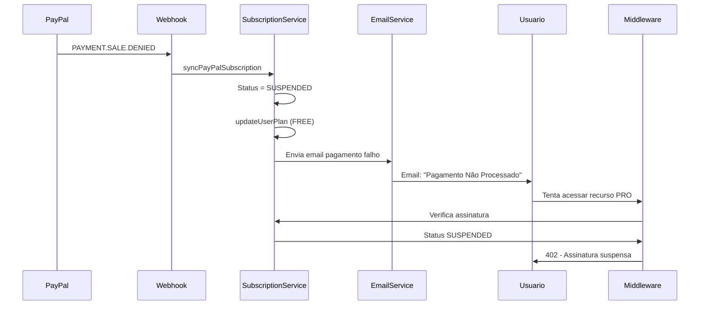

# Guia de Operação do PayPal - Sistema de Assinaturas

## 📋 Como Funciona o Sistema Atual

### Estrutura de Dados no Banco

1. **Tabela `plan_limits`** (✅ Editável via Admin)
   - **Onde**: `/admin/feature-limits`
   - **O que armazena**: Limites e features por plano (FREE, PRO, LIFETIME)
   - **Exemplo**: 
     - FREE: max_events = 5, max_participants_per_event = 20
     - PRO: max_events = NULL (ilimitado)
   - **Editável**: ✅ Sim, via interface admin

2. **Tabela `plans`** (✅ Editável via Admin)
   - **Onde**: `/admin/plans`
   - **O que armazena**: Preços, configurações e IDs PayPal dos planos (MONTHLY, YEARLY, LIFETIME)
   - **Campos principais**:
     - `plan_type`: MONTHLY, YEARLY, LIFETIME
     - `name`: Nome do plano
     - `price`: Preço (decimal com 2 casas)
     - `currency`: Moeda (padrão: BRL)
     - `interval_unit`: 'month' ou 'year' (para planos recorrentes)
     - `is_one_time`: true para LIFETIME, false para mensal/anual
     - `paypal_plan_id`: ID do plano no PayPal (começa com `P-`)
     - `enabled`: Se o plano está habilitado
   - **Editável**: ✅ Sim, via interface admin `/admin/plans`

3. **Planos PayPal** (Criados no Dashboard PayPal)
   - **Onde**: PayPal Developer Dashboard
   - **O que armazena**: IDs dos planos são salvos na tabela `plans` no campo `paypal_plan_id`
   - **Para mudar preços**: 
     - ✅ Editar direto na tabela `plans` via `/admin/plans` (se apenas mudar preço local)
     - ⚠️ Se mudar valor, precisa criar novo plano no PayPal e atualizar `paypal_plan_id`

## 🔧 Operação Atual do PayPal

### 1. Configuração Inicial

#### Criar Planos no PayPal Dashboard:

1. Acesse [PayPal Developer Dashboard](https://developer.paypal.com)
2. Vá em **My Apps & Credentials** → Selecione seu app
3. Vá em **Products** → **Create Product**
4. Crie um produto (ex: "Rachid PRO")

5. Vá em **Subscriptions** → **Create Plan**
   - **Plano Mensal**:
     - Nome: "PRO Mensal"
     - Preço: R$ 19,90
     - Intervalo: Mensal
     - Copie o Plan ID (começa com `P-`)
   - **Plano Anual**:
     - Nome: "PRO Anual"
     - Preço: R$ 199,00
     - Intervalo: Anual
     - Copie o Plan ID (começa com `P-`)

6. Configure Webhook:
   - URL: `https://api.orachid.com.br/api/subscriptions/webhook`
   - Eventos:
     - `BILLING.SUBSCRIPTION.*`
     - `PAYMENT.SALE.*`
     - `PAYMENT.CAPTURE.*`
   - Copie o Webhook ID

7. Configure variáveis de ambiente:
   ```env
   PAYPAL_PLAN_ID_MONTHLY=P-xxxxxxxxxxxxx
   PAYPAL_PLAN_ID_YEARLY=P-yyyyyyyyyyyyy
   PAYPAL_WEBHOOK_ID=WH-zzzzzzzzzzzzz
   ```

### 2. Como Editar Features/Limites

✅ **Pode editar via Admin**:
- Acesse `/admin/feature-limits` (requer permissão admin)
- Edite limites dinamicamente (ex: mudar FREE de 5 para 7 eventos)
- Mudanças são aplicadas imediatamente, sem deploy

### 3. Como Editar Preços dos Planos

✅ **Pode editar via Admin** (sem deploy):
- Acesse `/admin/plans` (requer permissão admin)
- Visualize todos os planos (MONTHLY, YEARLY, LIFETIME)
- Edite preços, nomes, descrições diretamente
- Habilitar/desabilitar planos
- Mudanças são aplicadas imediatamente

**Importante sobre mudanças de preço**:
- ✅ **Apenas mudar preço local**: Edite via `/admin/plans` - não precisa criar novo plano PayPal
  - O preço é atualizado no banco de dados
  - Usado para exibição na página de preços
  - Não afeta assinaturas existentes
- ⚠️ **Mudar valor real cobrado no PayPal**: Precisa criar novo plano no PayPal
  - **Opção 1**: Use a API com `createInPayPal: true` para criar automaticamente
  - **Opção 2**: Crie manualmente no PayPal Dashboard e atualize `paypal_plan_id`

**Veja o guia completo**: `COMO_ATUALIZAR_PRECO_PLANO.md`

### 4. Como Criar/Atualizar Planos no PayPal

#### Criar Novo Plano no PayPal (quando mudar preço real):

1. Acesse [PayPal Developer Dashboard](https://developer.paypal.com)
2. Vá em **My Apps & Credentials** → Selecione seu app
3. Vá em **Products** → **Create Product** (se não existir)
4. Vá em **Subscriptions** → **Create Plan**
   - Configure nome, preço, intervalo
   - Copie o Plan ID (começa com `P-`)
5. Atualize na interface admin:
   - Acesse `/admin/plans`
   - Edite o plano correspondente
   - Atualize o campo `paypal_plan_id` com o novo ID

#### Criar Plano no Banco (primeira vez):

- Use a interface `/admin/plans` ou API `/api/admin/plans`
- O sistema pode criar automaticamente no PayPal se `createInPayPal: true`

### 5. Sistema Atual (Implementado)

✅ **Preços no Banco de Dados**:
- Tabela `plans` armazena todos os dados dos planos
- Interface admin em `/admin/plans` para gerenciar
- Preços são lidos dinamicamente do banco
- Permite editar sem deploy

✅ **Integração PayPal**:
- IDs dos planos PayPal armazenados na tabela `plans`
- Sistema sincroniza automaticamente ao criar/atualizar

## 🎯 Resumo Rápido

| Item | Onde Está | Editável? | Como Editar |
|------|-----------|-----------|-------------|
| **Features/Limites** | `plan_limits` table | ✅ Sim | `/admin/feature-limits` |
| **Preços dos Planos** | `plans` table | ✅ Sim | `/admin/plans` |
| **Configuração Planos** | `plans` table | ✅ Sim | `/admin/plans` |
| **IDs Planos PayPal** | `plans.paypal_plan_id` | ✅ Sim | `/admin/plans` |
| **Planos PayPal** | PayPal Dashboard | ✅ Sim | PayPal Dashboard |

## 📝 Endpoints Disponíveis

### Para Usuários (Público/Protegido)
- `GET /api/subscriptions/plans` - Listar planos disponíveis (retorna preços formatados)
- `GET /api/features/plan-limits` - Listar limites de features por plano (público, para página de preços)

### Para Administradores
- `GET /api/admin/plans` - Listar todos os planos (inclui desabilitados)
- `GET /api/admin/plans/:planType` - Obter plano específico
- `POST /api/admin/plans` - Criar novo plano
- `PUT /api/admin/plans/:planType` - Atualizar plano existente

### Variáveis de Ambiente Necessárias
```env
# PayPal OAuth
PAYPAL_CLIENT_ID=seu-client-id
PAYPAL_CLIENT_SECRET=seu-client-secret
PAYPAL_MODE=sandbox|live

# PayPal Webhook
PAYPAL_WEBHOOK_ID=WH-xxxxxxxxxxxxx

# Opcional (para compatibilidade legada, mas não mais necessário)
# PAYPAL_PLAN_ID_MONTHLY e PAYPAL_PLAN_ID_YEARLY agora vêm da tabela plans
```

## 💡 Benefícios da Implementação Atual

✅ **Preços Dinâmicos**:
- Editar preços via admin sem deploy
- Mudanças aplicadas imediatamente
- Gerenciamento centralizado

✅ **Flexibilidade**:
- Habilitar/desabilitar planos facilmente
- Criar novos planos via admin
- Configurar promoções diretamente

✅ **Sincronização**:
- IDs PayPal armazenados junto com preços
- Fácil manter sincronizado
- Histórico de mudanças no banco

## 🔄 Workflow Completo

### Criar Nova Assinatura:
1. Usuário acessa `/precos`
2. Sistema busca planos de `/api/subscriptions/plans` (vem da tabela `plans`)
3. Usuário escolhe plano (MONTHLY/YEARLY)
4. Sistema busca `paypal_plan_id` da tabela `plans`
5. Cria assinatura no PayPal usando o `paypal_plan_id`
6. Usuário aprova no PayPal
7. Webhook ativa assinatura no sistema

### Criar Compra Lifetime:
1. Usuário escolhe LIFETIME em `/precos`
2. Sistema busca plano LIFETIME da tabela `plans`
3. Cria order no PayPal com preço do banco
4. Usuário aprova pagamento
5. Sistema captura pagamento e ativa plano LIFETIME

## ⚠️ Observações Importantes

1. **Preços no Banco vs PayPal**:
   - Os preços na tabela `plans` são usados para exibição
   - O valor real cobrado vem do plano PayPal (definido no `paypal_plan_id`)
   - Para mudar valor cobrado, precisa criar novo plano PayPal e atualizar `paypal_plan_id`

2. **Códigos Promocionais**:
   - Apenas para plano LIFETIME
   - Gerenciados via tabela `promo_codes`
   - Aplicados no momento do pagamento

3. **Webhooks**:
   - Necessário para ativar assinaturas automaticamente
   - Configurado em `/api/subscriptions/webhook`
   - Verifica assinatura usando `PAYPAL_WEBHOOK_ID`

## 🚨 Sistema de Inadimplência

### Como Funciona Quando o Usuário Fica Inadimplente

O sistema detecta automaticamente pagamentos falhos e gerencia a inadimplência de forma automática:

#### 1. **Pagamento Negado (PAYMENT.SALE.DENIED)**

Quando o PayPal não consegue processar um pagamento:

1. **PayPal envia webhook** `PAYMENT.SALE.DENIED`
2. **Sistema atualiza status** da assinatura para `SUSPENDED`
3. **Downgrade automático** do usuário para plano `FREE`
4. **Email enviado automaticamente** informando sobre o pagamento falho
5. **Bloqueio de acesso** a recursos PRO (middleware `requirePro` retorna 402)

#### 2. **Assinatura Suspensa (BILLING.SUBSCRIPTION.SUSPENDED)**

Quando a assinatura é suspensa:

1. **PayPal envia webhook** `BILLING.SUBSCRIPTION.SUSPENDED`
2. **Sistema mantém status** `SUSPENDED`
3. **Usuário permanece no plano FREE**
4. **Email enviado automaticamente** com instruções para reativar
5. **Acesso PRO bloqueado** até reativação

#### 3. **Assinatura Expirada (BILLING.SUBSCRIPTION.EXPIRED)**

Quando a assinatura expira:

1. **PayPal envia webhook** `BILLING.SUBSCRIPTION.EXPIRED`
2. **Sistema atualiza status** para `EXPIRED`
3. **Downgrade automático** para plano `FREE`
4. **Email enviado automaticamente** informando expiração
5. **Acesso PRO bloqueado**

### Data de Vencimento do Plano

**Campo Principal**: `subscriptions.current_period_end`

- **MONTHLY**: `currentPeriodStart + 1 mês`
- **YEARLY**: `currentPeriodStart + 1 ano`
- **LIFETIME**: `NULL` (nunca expira)

**Sincronização**:
- Campo `current_period_end` na tabela `subscriptions` (principal)
- Campo `plano_valido_ate` na tabela `usuarios` (legado, sincronizado automaticamente)

**Verificação**:
- Middleware `requirePro` verifica se `currentPeriodEnd > hoje`
- Se expirado, retorna erro `402 Payment Required` com `errorCode: 'SUBSCRIPTION_EXPIRED'`

### Emails Automáticos de Inadimplência

O sistema envia emails automaticamente nos seguintes casos:

1. **Pagamento Falho** (`pagamento-falho`):
   - Enviado quando `PAYMENT.SALE.DENIED` é recebido
   - Informa sobre o problema e como resolver
   - Inclui link para atualizar método de pagamento

2. **Assinatura Suspensa** (`assinatura-suspensa`):
   - Enviado quando assinatura muda para `SUSPENDED`
   - Instruções para reativar assinatura
   - Explica os limites do plano FREE

3. **Assinatura Expirada** (`assinatura-expirada`):
   - Enviado quando assinatura muda para `EXPIRED`
   - Convite para renovar assinatura
   - Lista benefícios do plano PRO

4. **Vencimento Próximo** (`vencimento-proximo`):
   - Enviado automaticamente **3 dias antes** do vencimento
   - Job agendado executa diariamente às 10:00 UTC (07:00 BRT)
   - Lembra sobre renovação automática
   - Enviado apenas se ainda não foi enviado nos últimos 7 dias

### Bloqueio de Acesso

**Como funciona**:

1. **Middleware `requirePro`** verifica:
   - Se assinatura existe
   - Se status é `ACTIVE`
   - Se `currentPeriodEnd > hoje` (para planos recorrentes)
   - Se planType é PRO (`MONTHLY`, `YEARLY`) ou `LIFETIME`

2. **Se não passar nas verificações**:
   - Retorna `402 Payment Required`
   - Inclui `errorCode` específico:
     - `PRO_REQUIRED`: Usuário não tem assinatura PRO
     - `SUBSCRIPTION_INACTIVE`: Assinatura não está ativa
     - `SUBSCRIPTION_EXPIRED`: Assinatura expirou
   - Inclui `upgradeUrl: '/precos'` para redirecionamento

3. **Downgrade Automático**:
   - Quando status muda para `SUSPENDED` ou `EXPIRED`, `updateUserPlan()` define:
     - `usuario.plano = 'FREE'`
     - `usuario.planoValidoAte = undefined`
   - Features PRO são desabilitadas automaticamente

### Jobs Agendados

**Verificação de Vencimento Próximo**:
- **Frequência**: Diário às 10:00 UTC (07:00 BRT)
- **Configuração**: Variável `VENCIMENTO_CRON` (padrão: `'0 10 * * *'`)
- **Função**: Busca assinaturas que expiram em 3 dias e envia aviso
- **Proteção**: Não envia múltiplos avisos (verifica últimos 7 dias)

### Fluxo Completo de Inadimplência



### Considerações Importantes

1. **Grace Period**: 
   - O PayPal tenta processar o pagamento automaticamente várias vezes
   - O sistema não implementa período de graça próprio (depende do PayPal)

2. **Múltiplas Tentativas**:
   - PayPal tenta cobrar automaticamente
   - Sistema não precisa gerenciar tentativas manualmente

3. **Reativação**:
   - Quando pagamento é bem-sucedido após falha, PayPal envia webhook de ativação
   - Sistema detecta mudança para `ACTIVE` e reativa features PRO automaticamente

4. **Rate Limiting de Emails**:
   - Sistema verifica histórico de emails antes de enviar avisos
   - Evita enviar múltiplos emails do mesmo tipo

5. **Opt-out**:
   - Respeita `usuario.receberEmails === false`
   - Usuários com opt-out não recebem emails de inadimplência
